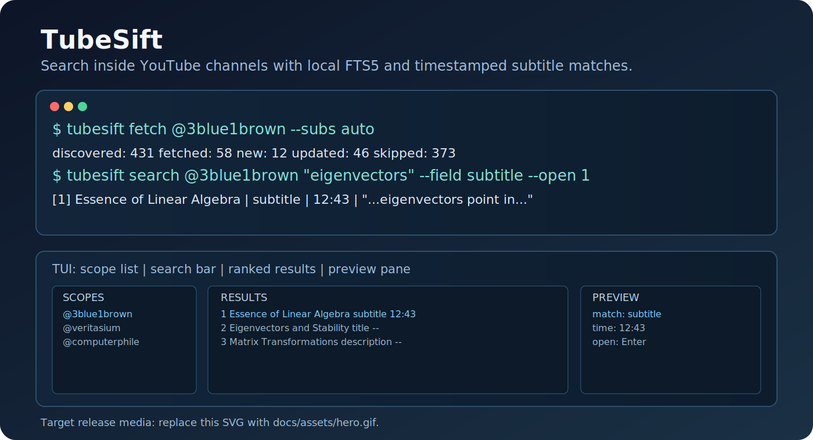
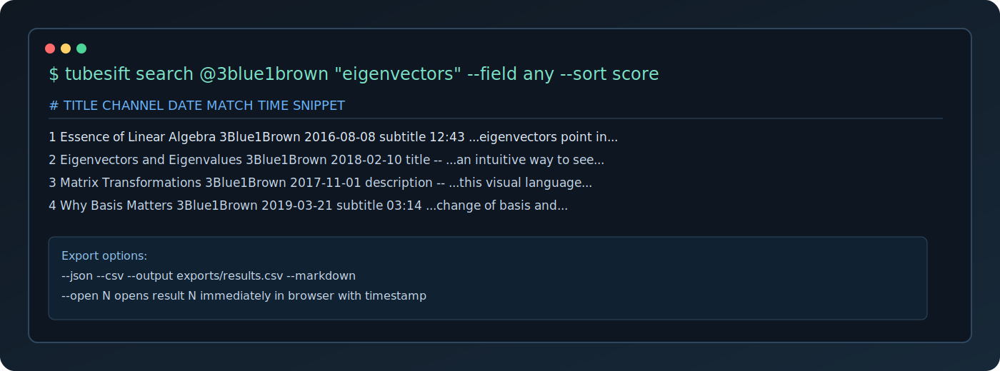
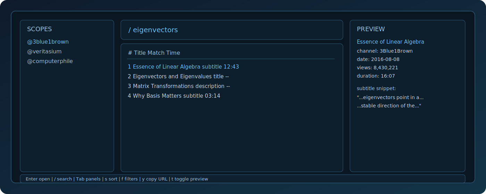

# TubeSift

The fastest zero-config way to search inside YouTube channels from your terminal.

TubeSift indexes channels and playlists into local SQLite FTS5 and gives instant search across title, description, and optional subtitles with exact timestamp links.



## Why This Exists

YouTube search is weak for this workflow:

> I know this phrase exists somewhere on this channel, find it now.

TubeSift is search-first and local-first:

- no API keys
- no Docker
- no login
- no external search backend
- regex, filters, and subtitle timestamps that can be piped to scripts

## Install

Fastest setup:

```bash
pipx install tubesift
```

Alternative package install:

```bash
pip install tubesift
```

Homebrew:

```bash
brew tap balyakin/tubesift
brew install tubesift
```

## Quick Start

```bash
tubesift fetch @3blue1brown --subs auto
tubesift search @3blue1brown "eigenvectors"
tubesift ui @3blue1brown
```

## Real Search Scenarios

```bash
# Metadata search with phrase
tubesift search @3blue1brown "\"linear algebra\"" --sort date

# Regex over candidate set
tubesift search @computerphile "regex|automata" --regex --no-shorts

# Subtitle-only search with language and direct open
tubesift search --all "transformer" --field subtitle --lang en --open 1

# Export to machine-readable formats
tubesift search @veritasium "black hole" --json > results.json
tubesift search @veritasium "black hole" --csv --output exports/results.csv
tubesift search @veritasium "black hole" --markdown > results.md
```

## Comparison

| Tool | Strong point | Why it is not enough | How TubeSift wins |
|---|---|---|---|
| YouTube Search | Global and easy | Weak channel-internal relevance, weak timestamp discovery | Local FTS5 + subtitle timestamp snippets + precise filters |
| Tube Archivist / downloader suites | Big archival workflows | Heavy stack and not search-first | One command to index, one command to find |
| ytfzf-like wrappers | Terminal UX | Mostly online search, limited local indexing | Offline-capable local DB with consistent CLI and exports |
| Subtitle-only niche tools | Timestamp search | Narrow scope or weaker UX | Metadata + subtitles + filters + TUI in one tool |

## Screenshots

CLI search:



TUI workflow:



## Command Model

```bash
tubesift fetch <scope>
tubesift sync [scope...]
tubesift search [scope] <query>
tubesift ui [scope]
tubesift list
tubesift info <scope>
tubesift top <scope>
tubesift open <video_id>
tubesift clear <scope>
tubesift doctor
```

Fetch and sync options:

```bash
tubesift fetch @channel --subs auto --refresh-recent 30
tubesift sync --subs all --refresh-recent 50
tubesift fetch @channel --cookies-from-browser chrome
tubesift fetch @channel --cookies ~/cookies.txt
```

## JSON, CSV, Markdown Exports

```bash
tubesift search @channel "query" --json
tubesift search @channel "query" --csv --output exports/results.csv
tubesift search @channel "query" --markdown
```

## Data Directory

```text
~/.tubesift/
├── tubesift.db
├── logs/
├── exports/
└── cache/
```

Set `TUBESIFT_HOME` to override this location.

## FAQ

**Does TubeSift download videos?**

No. TubeSift is search-first and indexes metadata/subtitles only.

**Does TubeSift require Google API keys?**

No. It uses `yt-dlp` and local SQLite.

**Can I search offline?**

Yes, once data is indexed locally.

**What if YouTube triggers bot-check challenges?**

Use cookie options from browser or cookie file:

```bash
tubesift fetch @channel --cookies-from-browser chrome
tubesift fetch @channel --cookies ~/cookies.txt
```

## Contributing

```bash
python -m venv .venv
source .venv/bin/activate
pip install -e .[dev]
pytest
```

Release automation notes are in `docs/RELEASING.md`.
